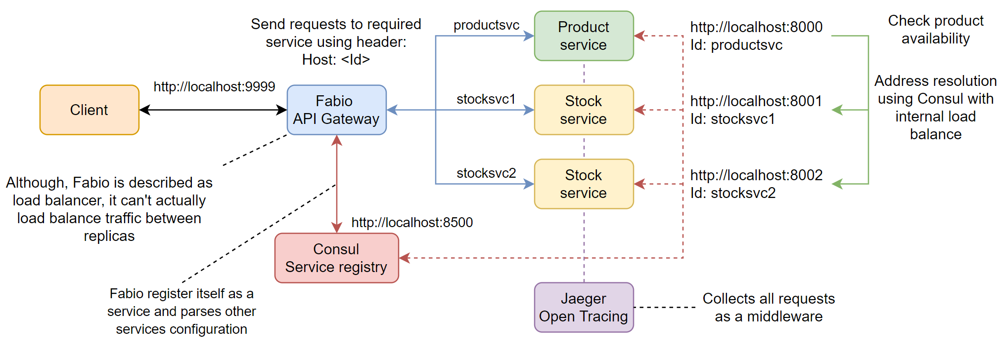

# Services with Service Registry

## Goal

The goal of this lab is to show how to use API gateway and service registry with load balancing and tracing.

## Project Architecture



## Service Registry

[Consul](https://developer.hashicorp.com/consul) is used as a service registry.

## API Gateway

[Fabio](https://fabiolb.net) is used as API gateway.

## Tracing

[Jaeger](https://www.jaegertracing.io) is used as a tracing system.

## Services

This project includes:

### Stock service (2 instances)

Get stock by product id:

```bash
curl -X GET http://localhost:8001/api/stock?id=1
curl -X GET http://localhost:8002/api/stock?id=1
```

### Product service

Get product by id and check availability:

```bash
curl -X GET http://localhost:8000/api/product?id=1
```

This action will call stock service to check availability.

### They use

- [Fiber](https://github.com/gofiber/fiber) as a web framework
- [Zap](https://github.com/uber-go/zap) as a logger

### Attention

Those services do not have clear structure, instead the main goal is to show how to use service registry with load balancing and tracing.

## Starting project

### Installation

```bash
go mod download
```

Download components:

- [Consul](https://developer.hashicorp.com/consul/downloads)
- [Fabio](https://github.com/fabiolb/fabio/releases)
- [Jaeger](https://www.jaegertracing.io/download/)

### Run

In separate terminals:

```bash
consul agent -dev
```

```bash
fabio
```

```bash
jaeger-all-in-one
```

And finally run services:

```bash
make run
```

### Build

```bash
make build
```

### Dev requirements

- Development reload tool: [reflex](https://github.com/cespare/reflex)

```bash
go install github.com/cespare/reflex@latest
```

### Run in dev mode

```bash
make watch
```
